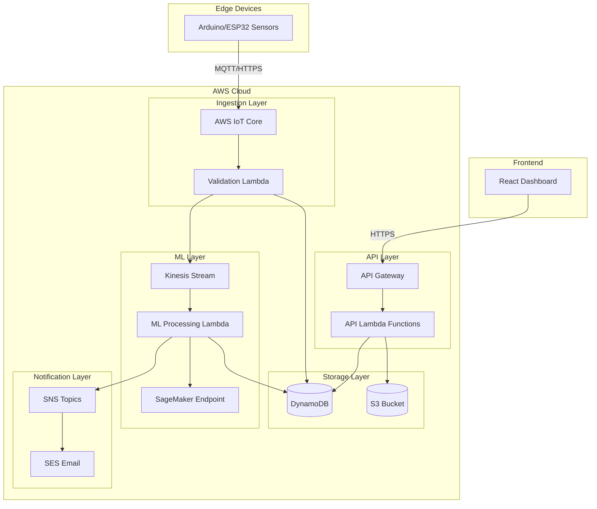

# Design Document: UdyogAI Predictive Maintenance Platform
Prepared by Team Sarvasiddhi  
AI for Bharat Hackathon – AWS Track  
Design Version: 1.0

## Design Goals
- Provide low-cost predictive maintenance for MSMEs
- Ensure high scalability using serverless AWS services
- Deliver real-time insights with minimal latency
- Support multilingual accessibility (English/Hindi)
- Enable easy IoT integration with affordable hardware

## Overview

UdyogAI is a cloud-native predictive maintenance platform built on AWS infrastructure that enables Indian MSMEs to monitor industrial machinery health in real-time and predict failures before they occur. The system follows a microservices architecture with clear separation between data ingestion, ML processing, and user-facing services.

The platform consists of five major subsystems:

1. **Data Ingestion Layer**: Receives and validates sensor data from IoT devices
2. **ML Processing Layer**: Analyzes time-series data, detects anomalies, and predicts failures
3. **API Layer**: Provides REST endpoints for frontend and external integrations
4. **Frontend Dashboard**: React-based web interface for monitoring and management
5. **Notification Service**: Multi-channel alert delivery system

The architecture prioritizes scalability, real-time processing, and cost-effectiveness suitable for small-scale industries.

## Architecture

### High-Level Architecture



### Data Flow

1. **Sensor Data Ingestion**:
   - Sensors send data via MQTT to AWS IoT Core
   - IoT Core triggers validation Lambda
   - Validated data stored in DynamoDB
   - Data streamed to Kinesis for ML processing

2. **ML Processing Pipeline**:
   - Kinesis stream triggers ML processing Lambda
   - Lambda fetches recent historical data from DynamoDB
   - Data sent to SageMaker endpoint for inference
   - Results (health score, anomalies, predictions) stored in DynamoDB
   - High-severity alerts trigger SNS notifications

3. **User Interaction**:
   - React frontend calls API Gateway endpoints
   - Lambda functions query DynamoDB for machine data
   - Historical data aggregated from DynamoDB/S3
   - Real-time updates via WebSocket connections

### Technology Stack Rationale

- **AWS IoT Core**: Native MQTT support, device management, scalable ingestion
- **DynamoDB**: Low-latency NoSQL for time-series data, auto-scaling
- **Lambda**: Serverless compute, pay-per-use, automatic scaling
- **SageMaker**: Managed ML infrastructure, easy model deployment
- **Kinesis**: Real-time stream processing for ML pipeline
- **React**: Component-based UI, rich ecosystem, responsive design
- **Node.js**: JavaScript across stack, async I/O for APIs
- **Python**: ML/AI ecosystem (TensorFlow, scikit-learn, pandas)

## Components and Interfaces

### 1. Data Ingestion Service

**Responsibility**: Receive, validate, and store sensor data from IoT devices.

**Components**:
- `IoTMessageHandler`: Processes incoming MQTT messages from AWS IoT Core
- `DataValidator`: Validates sensor data format, ranges, and timestamps
- `DataWriter`: Writes validated data to DynamoDB and Kinesis

**Interfaces**:

```typescript
interface SensorReading {
  machine_id: string;
  timestamp: number; // Unix timestamp in milliseconds
  vibration: number; // mm/s, range 0-100
  temperature: number; // Celsius, range -50 to 200
  load: number; // percentage, range 0-100
}

interface ValidationResult {
  valid: boolean;
  errors: string[];
}

class DataValidator {
  validate(reading: SensorReading): ValidationResult;
  validateVibration(value: number): boolean;
  validateTemperature(value: number): boolean;
  validateLoad(value: number): boolean;
  validateTimestamp(timestamp: number): boolean;
}

class DataWriter {
  async writeToDynamoDB(reading: SensorReading): Promise<void>;
  async writeToKinesis(reading: SensorReading): Promise<void>;
}
```

**DynamoDB Schema**:

```typescript
// Table: SensorData
{
  PK: "MACHINE#{machine_id}",
  SK: "READING#{timestamp}",
  vibration: number,
  temperature: number,
  load: number,
  timestamp: number,
  ttl: number // Auto-delete after 90 days
}
```

### 2. ML Processing Service

**Responsibility**: Analyze sensor data, detect anomalies, calculate health scores, and predict failures.

**Components**:
- `StreamProcessor`: Processes records from Kinesis stream
- `FeatureExtractor`: Extracts features from time-series data
- `AnomalyDetector`: Detects deviations from normal patterns
- `HealthScoreCalculator`: Computes machine health scores
- `FailurePredictor`: Predicts failure probability using LSTM model
- `AlertGenerator`: Creates alerts based on thresholds

**Interfaces**:

```python
from dataclasses import dataclass
from typing import List, Tuple
import numpy as np

@dataclass
class TimeSeriesData:
    timestamps: List[int]
    vibration: List[float]
    temperature: List[float]
    load: List[float]

@dataclass
class AnomalyResult:
    is_anomaly: bool
    anomaly_type: str  # 'vibration', 'temperature', 'load', or 'combined'
    deviation_score: float  # Standard deviations from baseline
    timestamp: int

@dataclass
class HealthScore:
    score: int  # 0-100
    timestamp: int
    contributing_factors: dict  # Which metrics affected the score

@dataclass
class FailureRisk:
    risk_24h: float  # 0-100%
    risk_7d: float
    risk_30d: float
    confidence: float  # Model confidence 0-1
    timestamp: int

class FeatureExtractor:
    def extract_statistical_features(self, data: TimeSeriesData) -> np.ndarray:
        """Extract mean, std, min, max, trend for each sensor"""
        pass
    
    def extract_frequency_features(self, data: TimeSeriesData) -> np.ndarray:
        """Extract FFT features for vibration analysis"""
        pass

class AnomalyDetector:
    def __init__(self, baseline_mean: dict, baseline_std: dict):
        self.baseline_mean = baseline_mean
        self.baseline_std = baseline_std
    
    def detect(self, reading: dict) -> AnomalyResult:
        """Detect if reading deviates >3 std from baseline"""
        pass
    
    def update_baseline(self, historical_data: TimeSeriesData) -> None:
        """Update baseline statistics weekly"""
        pass

class HealthScoreCalculator:
    def calculate(self, 
                  recent_data: TimeSeriesData,
                  anomalies: List[AnomalyResult]) -> HealthScore:
        """
        Calculate health score based on:
        - Recent anomaly frequency
        - Sensor value trends
        - Deviation from optimal ranges
        """
        pass

class FailurePredictor:
    def __init__(self, model_endpoint: str):
        self.model_endpoint = model_endpoint
    
    def predict(self, features: np.ndarray) -> FailureRisk:
        """Call SageMaker endpoint for LSTM prediction"""
        pass

class AlertGenerator:
    def generate_alerts(self,
                       health_score: HealthScore,
                       failure_risk: FailureRisk,
                       anomalies: List[AnomalyResult]) -> List[dict]:
        """Generate alerts based on thresholds"""
        pass
```

**ML Model Architecture**:

The LSTM model for failure prediction:

```python
# Model architecture (TensorFlow/Keras)
from tensorflow.keras.models import Sequential
from tensorflow.keras.layers import LSTM, Dense, Dropout

def build_lstm_model(sequence_length: int, n_features: int):
    model = Sequential([
        LSTM(64, return_sequences=True, input_shape=(sequence_length, n_features)),
        Dropout(0.2),
        LSTM(32, return_sequences=False),
        Dropout(0.2),
        Dense(16, activation='relu'),
        Dense(3, activation='sigmoid')  # 3 outputs: 24h, 7d, 30d risk
    ])
    model.compile(optimizer='adam', loss='binary_crossentropy', metrics=['accuracy'])
    return model
```

**Feature Engineering**:
- Window size: 24 hours of data (288 readings at 5-min intervals)
- Features per reading: vibration, temperature, load (3 base features)
- Statistical features: mean, std, min, max, trend (5 × 3 = 15 features)
- Frequency features: dominant frequency, amplitude (2 × 1 = 2 features for vibration)
- Total: 17 features per time window

### 3. API Service

**Responsibility**: Provide REST endpoints for frontend and external integrations.

**Endpoints**:

```typescript
// Machine Management
GET    /api/v1/machines
GET    /api/v1/machines/:id
POST   /api/v1/machines
PUT    /api/v1/machines/:id
DELETE /api/v1/machines/:id

// Sensor Data
POST   /api/v1/sensor-data
GET    /api/v1/machines/:id/sensor-data?start=<timestamp>&end=<timestamp>

// Health and Predictions
GET    /api/v1/machines/:id/health
GET    /api/v1/machines/:id/predictions
GET    /api/v1/machines/:id/anomalies

// Alerts
GET    /api/v1/alerts
GET    /api/v1/alerts/:id
PUT    /api/v1/alerts/:id/acknowledge
GET    /api/v1/machines/:id/alerts

// Maintenance
GET    /api/v1/machines/:id/recommendations
POST   /api/v1/maintenance-actions
GET    /api/v1/maintenance-actions

// Historical Data
GET    /api/v1/machines/:id/history?range=<1d|7d|30d|1y>
GET    /api/v1/machines/:id/export?format=csv&start=<timestamp>&end=<timestamp>

// Authentication
POST   /api/v1/auth/login
POST   /api/v1/auth/logout
POST   /api/v1/auth/refresh
```

**API Lambda Handler Structure**:

```typescript
interface APIRequest {
  httpMethod: string;
  path: string;
  headers: Record<string, string>;
  queryStringParameters: Record<string, string>;
  body: string;
  requestContext: {
    authorizer: {
      userId: string;
      role: string;
    }
  }
}

interface APIResponse {
  statusCode: number;
  headers: Record<string, string>;
  body: string;
}

class MachineController {
  async getMachines(userId: string, role: string): Promise<Machine[]>;
  async getMachine(machineId: string, userId: string): Promise<Machine>;
  async createMachine(data: CreateMachineRequest, userId: string): Promise<Machine>;
  async updateMachine(machineId: string, data: UpdateMachineRequest): Promise<Machine>;
  async deleteMachine(machineId: string, userId: string): Promise<void>;
}

class HealthController {
  async getCurrentHealth(machineId: string): Promise<HealthScore>;
  async getPredictions(machineId: string): Promise<FailureRisk>;
  async getAnomalies(machineId: string, limit: number): Promise<AnomalyResult[]>;
}

class AlertController {
  async getAlerts(userId: string, filters: AlertFilters): Promise<Alert[]>;
  async acknowledgeAlert(alertId: string, userId: string): Promise<void>;
}
```

### 4. Frontend Dashboard

**Responsibility**: Provide intuitive web interface for monitoring and management.

**Component Structure**:

```typescript
// React component hierarchy
App
├── AuthProvider
├── Router
│   ├── LoginPage
│   ├── DashboardPage
│   │   ├── MachineGrid
│   │   │   └── MachineCard (health score, status indicator)
│   │   ├── AlertPanel
│   │   └── QuickStats
│   ├── MachineDetailPage
│   │   ├── HealthScoreWidget
│   │   ├── PredictionWidget
│   │   ├── SensorCharts (vibration, temp, load)
│   │   ├── AnomalyTimeline
│   │   └── RecommendationsList
│   ├── HistoricalAnalysisPage
│   │   ├── DateRangePicker
│   │   ├── TrendCharts
│   │   └── ComparisonView
│   ├── AlertsPage
│   │   └── AlertTable
│   ├── MachineManagementPage
│   │   ├── MachineList
│   │   └── MachineForm
│   └── SettingsPage
└── NotificationToast
```

**Key React Components**:

```typescript
interface MachineCardProps {
  machine: Machine;
  healthScore: HealthScore;
  onClick: () => void;
}

const MachineCard: React.FC<MachineCardProps> = ({ machine, healthScore, onClick }) => {
  const statusColor = getStatusColor(healthScore.score);
  return (
    <Card onClick={onClick} style={{ borderLeft: `4px solid ${statusColor}` }}>
      <h3>{machine.name}</h3>
      <HealthScoreBadge score={healthScore.score} />
      <StatusIndicator status={getStatus(healthScore.score)} />
    </Card>
  );
};

interface SensorChartProps {
  machineId: string;
  sensorType: 'vibration' | 'temperature' | 'load';
  timeRange: '1d' | '7d' | '30d';
}

const SensorChart: React.FC<SensorChartProps> = ({ machineId, sensorType, timeRange }) => {
  const { data, loading } = useSensorData(machineId, sensorType, timeRange);
  
  return (
    <ChartContainer>
      <LineChart data={data} />
      <AnomalyMarkers anomalies={data.anomalies} />
    </ChartContainer>
  );
};
```

**State Management**:

```typescript
// Using React Context + Hooks for state management
interface AppState {
  user: User | null;
  machines: Machine[];
  alerts: Alert[];
  selectedMachine: Machine | null;
}

const AppContext = React.createContext<AppState | null>(null);

// Custom hooks
function useMachines() {
  const [machines, setMachines] = useState<Machine[]>([]);
  const [loading, setLoading] = useState(true);
  
  useEffect(() => {
    fetchMachines().then(setMachines).finally(() => setLoading(false));
  }, []);
  
  return { machines, loading, refetch: () => fetchMachines().then(setMachines) };
}

function useRealTimeUpdates(machineId: string) {
  const [healthScore, setHealthScore] = useState<HealthScore | null>(null);
  
  useEffect(() => {
    const interval = setInterval(() => {
      fetchHealthScore(machineId).then(setHealthScore);
    }, 30000); // Poll every 30 seconds
    
    return () => clearInterval(interval);
  }, [machineId]);
  
  return healthScore;
}
```

### 5. Notification Service

**Responsibility**: Deliver alerts through multiple channels (email, SMS, in-app).

**Components**:

```typescript
interface NotificationChannel {
  type: 'email' | 'sms' | 'in-app';
  enabled: boolean;
  config: Record<string, any>;
}

interface NotificationPreferences {
  userId: string;
  channels: NotificationChannel[];
  severityFilter: ('low' | 'medium' | 'high')[];
  language: 'en' | 'hi';
}

class NotificationService {
  async sendAlert(alert: Alert, preferences: NotificationPreferences): Promise<void>;
  async sendEmail(to: string, subject: string, body: string, language: string): Promise<void>;
  async sendSMS(to: string, message: string, language: string): Promise<void>;
  async sendInAppNotification(userId: string, notification: object): Promise<void>;
  async retryFailedNotification(notificationId: string, attempt: number): Promise<void>;
}

class MessageFormatter {
  formatAlertEmail(alert: Alert, language: string): { subject: string; body: string };
  formatAlertSMS(alert: Alert, language: string): string;
  translateMessage(message: string, language: string): string;
}
```

**SNS Topic Structure**:

```yaml
Topics:
  - HighSeverityAlerts: For immediate notifications
  - MediumSeverityAlerts: For batched notifications
  - SystemAlerts: For platform health monitoring

Subscriptions:
  - Email: SES for email delivery
  - SMS: SNS SMS for text messages
  - Lambda: For in-app notification processing
```

## Data Models

### DynamoDB Tables

**1. SensorData Table**:
```typescript
{
  TableName: "SensorData",
  KeySchema: [
    { AttributeName: "PK", KeyType: "HASH" },  // MACHINE#{machine_id}
    { AttributeName: "SK", KeyType: "RANGE" }  // READING#{timestamp}
  ],
  Attributes: {
    PK: "String",
    SK: "String",
    vibration: "Number",
    temperature: "Number",
    load: "Number",
    timestamp: "Number",
    ttl: "Number"
  },
  TTL: { Enabled: true, AttributeName: "ttl" },
  StreamEnabled: true
}
```

**2. Machines Table**:
```typescript
{
  TableName: "Machines",
  KeySchema: [
    { AttributeName: "PK", KeyType: "HASH" },  // FACTORY#{factory_id}
    { AttributeName: "SK", KeyType: "RANGE" }  // MACHINE#{machine_id}
  ],
  Attributes: {
    PK: "String",
    SK: "String",
    machine_id: "String",
    name: "String",
    type: "String",
    thresholds: {
      vibration_max: "Number",
      temperature_max: "Number",
      load_max: "Number"
    },
    status: "String",  // 'active' | 'inactive'
    created_at: "Number",
    updated_at: "Number"
  },
  GSI: [
    {
      IndexName: "MachineIdIndex",
      KeySchema: [{ AttributeName: "machine_id", KeyType: "HASH" }]
    }
  ]
}
```

**3. HealthScores Table**:
```typescript
{
  TableName: "HealthScores",
  KeySchema: [
    { AttributeName: "PK", KeyType: "HASH" },  // MACHINE#{machine_id}
    { AttributeName: "SK", KeyType: "RANGE" }  // HEALTH#{timestamp}
  ],
  Attributes: {
    PK: "String",
    SK: "String",
    score: "Number",
    contributing_factors: "Map",
    timestamp: "Number",
    ttl: "Number"
  }
}
```

**4. Predictions Table**:
```typescript
{
  TableName: "Predictions",
  KeySchema: [
    { AttributeName: "PK", KeyType: "HASH" },  // MACHINE#{machine_id}
    { AttributeName: "SK", KeyType: "RANGE" }  // PREDICTION#{timestamp}
  ],
  Attributes: {
    PK: "String",
    SK: "String",
    risk_24h: "Number",
    risk_7d: "Number",
    risk_30d: "Number",
    confidence: "Number",
    timestamp: "Number",
    ttl: "Number"
  }
}
```

**5. Anomalies Table**:
```typescript
{
  TableName: "Anomalies",
  KeySchema: [
    { AttributeName: "PK", KeyType: "HASH" },  // MACHINE#{machine_id}
    { AttributeName: "SK", KeyType: "RANGE" }  // ANOMALY#{timestamp}
  ],
  Attributes: {
    PK: "String",
    SK: "String",
    anomaly_type: "String",
    deviation_score: "Number",
    affected_sensors: "List",
    timestamp: "Number",
    ttl: "Number"
  }
}
```

**6. Alerts Table**:
```typescript
{
  TableName: "Alerts",
  KeySchema: [
    { AttributeName: "PK", KeyType: "HASH" },  // ALERT#{alert_id}
    { AttributeName: "SK", KeyType: "RANGE" }  // TIMESTAMP#{timestamp}
  ],
  Attributes: {
    PK: "String",
    SK: "String",
    alert_id: "String",
    machine_id: "String",
    severity: "String",  // 'low' | 'medium' | 'high'
    trigger_condition: "String",
    message: "String",
    acknowledged: "Boolean",
    acknowledged_by: "String",
    acknowledged_at: "Number",
    timestamp: "Number"
  },
  GSI: [
    {
      IndexName: "MachineAlertsIndex",
      KeySchema: [
        { AttributeName: "machine_id", KeyType: "HASH" },
        { AttributeName: "timestamp", KeyType: "RANGE" }
      ]
    },
    {
      IndexName: "UnacknowledgedAlertsIndex",
      KeySchema: [
        { AttributeName: "acknowledged", KeyType: "HASH" },
        { AttributeName: "timestamp", KeyType: "RANGE" }
      ]
    }
  ]
}
```

**7. Users Table**:
```typescript
{
  TableName: "Users",
  KeySchema: [
    { AttributeName: "PK", KeyType: "HASH" },  // USER#{user_id}
    { AttributeName: "SK", KeyType: "RANGE" }  // PROFILE
  ],
  Attributes: {
    PK: "String",
    SK: "String",
    user_id: "String",
    username: "String",
    password_hash: "String",
    role: "String",  // 'factory_owner' | 'supervisor' | 'maintenance_team'
    factory_id: "String",
    email: "String",
    phone: "String",
    notification_preferences: "Map",
    created_at: "Number"
  },
  GSI: [
    {
      IndexName: "UsernameIndex",
      KeySchema: [{ AttributeName: "username", KeyType: "HASH" }]
    }
  ]
}
```

### S3 Bucket Structure

```
udyogai-ml-models/
├── models/
│   ├── lstm-v1.0/
│   │   ├── model.tar.gz
│   │   └── metadata.json
│   └── lstm-v1.1/
│       ├── model.tar.gz
│       └── metadata.json
├── training-data/
│   ├── factory-001/
│   │   └── machine-001/
│   │       └── 2024-01/
│   │           └── training-set.parquet
│   └── factory-002/
└── baselines/
    └── machine-{id}-baseline.json
```


## Correctness Properties

A property is a characteristic or behavior that should hold true across all valid executions of a system—essentially, a formal statement about what the system should do. Properties serve as the bridge between human-readable specifications and machine-verifiable correctness guarantees.

### Property Reflection

After analyzing all acceptance criteria, several properties can be consolidated to avoid redundancy:

- Criteria 1.3, 1.4, 1.5 (sensor range validations) → Combined into Property 1
- Criteria 2.5, 2.6, 2.7 (health score classifications) → Combined into Property 5
- Criteria 3.3, 3.4, 3.5 (anomaly detection thresholds) → Combined into Property 8
- Criteria 4.3, 4.4, 4.5 (risk classifications) → Combined into Property 11
- Criteria 5.1, 5.2, 5.3, 5.4 (alert generation rules) → Combined into Property 13
- Criteria 10.3, 10.4, 10.5 (role-based permissions) → Combined into Property 28
- Criteria 14.3, 14.4 (data retention) → Combined into Property 35

### Data Ingestion Properties

**Property 1: Sensor value range validation**
*For any* sensor reading with vibration (0-100 mm/s), temperature (-50 to 200°C), and load (0-100%), the validation function should accept values within these ranges and reject values outside these ranges.
**Validates: Requirements 1.3, 1.4, 1.5**

**Property 2: Sensor data format validation**
*For any* sensor data object, the validation function should accept data with all required fields (machine_id, timestamp, vibration, temperature, load) in correct format and reject data missing required fields or with incorrect types.
**Validates: Requirements 1.1, 1.6**

**Property 3: Sensor data storage integrity**
*For any* valid sensor reading, after storage, retrieving the data by machine_id and timestamp should return the same vibration, temperature, and load values.
**Validates: Requirements 1.7**

### Health Score Properties

**Property 4: Health score bounds**
*For any* machine with sufficient data, the calculated health score should always be a value between 0 and 100 inclusive.
**Validates: Requirements 2.2**

**Property 5: Health score classification**
*For any* health score value, the classification should be "attention needed" when score < 70, "moderate health" when 70 ≤ score ≤ 85, and "healthy" when score > 85.
**Validates: Requirements 2.5, 2.6, 2.7**

**Property 6: Health score calculation determinism**
*For any* machine, given the same sensor data from the last 24 hours, calculating the health score multiple times should produce the same result.
**Validates: Requirements 2.1**

### Anomaly Detection Properties

**Property 7: Anomaly record completeness**
*For any* detected anomaly, the anomaly record should contain anomaly_type, timestamp, and affected_sensors fields.
**Validates: Requirements 3.2**

**Property 8: Statistical anomaly detection**
*For any* sensor reading where vibration, temperature, or load exceeds 3 standard deviations from the machine's baseline, the system should flag it as an anomaly.
**Validates: Requirements 3.3, 3.4, 3.5**

**Property 9: Anomaly impact on health score**
*For any* machine, when an anomaly is detected, the health score calculated after the anomaly should be lower than or equal to the health score before the anomaly (assuming no other positive changes).
**Validates: Requirements 3.6**

### Failure Prediction Properties

**Property 10: Failure risk bounds**
*For any* machine with sufficient data, all calculated failure risk values (24h, 7d, 30d) should be percentages between 0 and 100 inclusive.
**Validates: Requirements 4.2**

**Property 11: Failure risk classification**
*For any* failure risk percentage, the classification should be "high risk" when risk > 70%, "medium risk" when 40% ≤ risk ≤ 70%, and "low risk" when risk < 40%.
**Validates: Requirements 4.3, 4.4, 4.5**

**Property 12: Multi-window prediction completeness**
*For any* machine with sufficient data, the prediction result should include risk values for all three time windows: 24 hours, 7 days, and 30 days.
**Validates: Requirements 4.1**

### Alert Management Properties

**Property 13: Alert generation rules**
*For any* machine state, a high-severity alert should be generated when failure_risk > 70% OR anomaly deviation > 4 std, and a medium-severity alert should be generated when 40% ≤ failure_risk ≤ 70% OR health_score < 60.
**Validates: Requirements 5.1, 5.2, 5.3, 5.4**

**Property 14: Alert data completeness**
*For any* generated alert, it should contain machine_id, timestamp, severity, and trigger_condition fields.
**Validates: Requirements 5.5**

**Property 15: Alert consolidation**
*For any* machine, if multiple alerts are generated within a 1-hour window, they should be consolidated into a single alert with combined trigger conditions.
**Validates: Requirements 5.6**

**Property 16: Alert acknowledgment state**
*For any* alert, after acknowledgment by a user, the alert should have acknowledged=true, acknowledged_by set to the user ID, and acknowledged_at set to the acknowledgment timestamp.
**Validates: Requirements 5.7**

### Maintenance Recommendation Properties

**Property 17: Recommendation presence**
*For any* generated alert, there should be at least one associated maintenance recommendation.
**Validates: Requirements 6.1**

**Property 18: High-risk recommendation metadata**
*For any* maintenance recommendation associated with high failure risk (>70%), the recommendation should include urgency_level and estimated_time fields.
**Validates: Requirements 6.5**

**Property 19: Recommendation bilingual support**
*For any* maintenance recommendation, it should have text available in both English ('en') and Hindi ('hi') languages.
**Validates: Requirements 6.6**

**Property 20: Recommendation completion tracking**
*For any* maintenance recommendation, after marking it as completed, it should have completed=true, completed_by set to the user ID, completed_at timestamp, and allow optional notes.
**Validates: Requirements 6.7**

### Dashboard Visualization Properties

**Property 21: Health status color mapping**
*For any* machine health score, the color code should be green when score > 85, yellow when 70 ≤ score ≤ 85, and red when score < 70.
**Validates: Requirements 7.2**

### Historical Data Properties

**Property 22: Historical query time range**
*For any* historical data query with start and end timestamps, all returned sensor readings should have timestamps within the range [start, end] inclusive.
**Validates: Requirements 8.1**

**Property 23: CSV export round-trip**
*For any* set of historical sensor data, exporting to CSV format and then parsing the CSV should produce equivalent data with the same machine_id, timestamps, and sensor values.
**Validates: Requirements 8.7**

### Machine Management Properties

**Property 24: Machine registration required fields**
*For any* machine registration request, it should be accepted only if it contains name, type, and unique_identifier fields, and rejected otherwise.
**Validates: Requirements 9.1**

**Property 25: Machine ID uniqueness**
*For any* two successfully registered machines, their generated machine IDs should be different.
**Validates: Requirements 9.2**

**Property 26: Custom threshold persistence**
*For any* machine, after setting custom threshold values for vibration, temperature, and load, retrieving the machine configuration should return the same threshold values.
**Validates: Requirements 9.3**

**Property 27: Default threshold initialization**
*For any* newly registered machine of a specific type, it should be initialized with default threshold values appropriate for that machine type.
**Validates: Requirements 9.4**

**Property 28: Machine deactivation behavior**
*For any* machine, after deactivation, new sensor data for that machine should be rejected, but historical sensor data should remain queryable.
**Validates: Requirements 9.6**

### Authentication and Authorization Properties

**Property 29: Authentication requirement**
*For any* protected API endpoint, requests without valid authentication credentials should be rejected with HTTP 401.
**Validates: Requirements 10.1**

**Property 30: Session validity duration**
*For any* successful login, the created session should be valid for 8 hours from creation time and invalid after that period.
**Validates: Requirements 10.2**

**Property 31: Role-based access control**
*For any* user, factory_owner role should have access to all features, supervisor role should have access to monitoring/alerts/recommendations but not machine registration, and maintenance_team role should have access only to alerts and recommendations.
**Validates: Requirements 10.3, 10.4, 10.5**

**Property 32: Authorization enforcement**
*For any* user attempting an action they don't have permission for, the request should be denied and an audit log entry should be created.
**Validates: Requirements 10.6**

**Property 33: Session invalidation on logout**
*For any* active session, after logout, any subsequent requests using that session token should be rejected as unauthorized.
**Validates: Requirements 10.7**

### ML Model Monitoring Properties

**Property 34: Model performance alerting**
*For any* ML model version, when its accuracy drops below 75%, a system alert should be generated for administrators.
**Validates: Requirements 11.6**

### API Integration Properties

**Property 35: API authentication requirement**
*For any* sensor data submission via API, requests without a valid API key should be rejected with HTTP 401.
**Validates: Requirements 12.2**

**Property 36: API JSON format validation**
*For any* API request, it should be accepted only if the JSON contains machine_id, timestamp, vibration, temperature, and load fields in correct format, otherwise return HTTP 400 with error details.
**Validates: Requirements 12.4, 12.5**

**Property 37: API authentication error response**
*For any* API request with invalid or missing API key, the response should have HTTP status 401.
**Validates: Requirements 12.6**

**Property 38: API batch processing**
*For any* batch API request containing up to 100 sensor readings, all valid readings should be processed and stored, and the response should indicate which readings succeeded and which failed.
**Validates: Requirements 12.7**

### Data Retention Properties

**Property 39: Data retention policy enforcement**
*For any* sensor data, raw readings should be queryable for 90 days after creation, and aggregated daily summaries should be queryable for 2 years after creation.
**Validates: Requirements 14.3, 14.4**

**Property 40: Automatic data expiration**
*For any* sensor data older than its retention period (90 days for raw, 2 years for aggregated), it should not be returned in query results.
**Validates: Requirements 14.5**

**Property 41: Multi-tenant data isolation**
*For any* two different factory accounts, queries from one factory should never return data belonging to the other factory.
**Validates: Requirements 14.6**

### Notification Properties

**Property 42: High-severity alert notification**
*For any* high-severity alert, notifications should be sent through all enabled channels (email, SMS, in-app) configured in user preferences.
**Validates: Requirements 15.1**

**Property 43: Notification preference filtering**
*For any* alert, notifications should only be sent to users whose notification preferences include that alert's severity level.
**Validates: Requirements 15.5**

**Property 44: Notification retry logic**
*For any* failed notification delivery, the system should retry up to 3 times with exponential backoff (e.g., 1s, 2s, 4s delays).
**Validates: Requirements 15.6**

**Property 45: Notification language support**
*For any* notification, it should be available in both English and Hindi based on user's language preference.
**Validates: Requirements 15.7**

## Error Handling

### Validation Errors

**Sensor Data Validation**:
- Invalid ranges: Return descriptive error indicating which sensor value is out of range
- Missing fields: Return error listing all missing required fields
- Invalid types: Return error indicating expected vs actual data types
- Malformed JSON: Return HTTP 400 with JSON parsing error details

**Machine Registration Errors**:
- Duplicate machine ID: Return HTTP 409 Conflict with message
- Missing required fields: Return HTTP 400 with field validation errors
- Invalid machine type: Return HTTP 400 with list of valid types

**Authentication Errors**:
- Invalid credentials: Return HTTP 401 with generic "Invalid credentials" message (no user enumeration)
- Expired session: Return HTTP 401 with "Session expired" message
- Missing API key: Return HTTP 401 with "API key required" message
- Invalid API key: Return HTTP 401 with "Invalid API key" message

**Authorization Errors**:
- Insufficient permissions: Return HTTP 403 with "Insufficient permissions for this action"
- Resource not found: Return HTTP 404 (don't reveal existence to unauthorized users)

### ML Processing Errors

**Insufficient Data**:
- Less than 1 hour of data: Display "Insufficient Data" for health score
- Less than 30 days of data: Display "Prediction Unavailable" for failure risk
- No baseline established: Use default baseline until sufficient data collected

**Model Inference Errors**:
- SageMaker endpoint unavailable: Log error, use last known prediction, alert administrators
- Model prediction timeout: Retry once, then use last known prediction
- Invalid model output: Log error, mark prediction as unavailable, alert administrators

**Anomaly Detection Errors**:
- Baseline not yet calculated: Skip anomaly detection until baseline established
- Corrupted baseline data: Recalculate baseline from available historical data

### Data Storage Errors

**DynamoDB Errors**:
- Write throttling: Implement exponential backoff retry (up to 3 attempts)
- Item size exceeded: Log error, truncate non-essential fields, retry
- Conditional check failed: Handle optimistic locking conflicts

**S3 Errors**:
- Upload failed: Retry up to 3 times with exponential backoff
- Object not found: Return appropriate error to caller
- Access denied: Log error, alert administrators

### External Service Errors

**Notification Delivery Failures**:
- Email delivery failed (SES): Retry up to 3 times, log failure, mark notification as failed
- SMS delivery failed: Retry up to 3 times, log failure, try alternative channel
- Network timeout: Retry with exponential backoff

**IoT Core Errors**:
- Connection lost: Device should implement reconnection logic with exponential backoff
- Message rejected: Log error with reason, alert device owner
- Throttling: Implement client-side rate limiting

### Error Logging and Monitoring

All errors should be logged with:
- Timestamp
- Error type and message
- Request context (user ID, machine ID, etc.)
- Stack trace (for unexpected errors)
- Correlation ID for distributed tracing

Critical errors should trigger CloudWatch alarms:
- Model accuracy below threshold
- High error rate (>5% of requests)
- Service unavailability
- Data pipeline failures

## Testing Strategy

### Dual Testing Approach

UdyogAI requires both unit testing and property-based testing for comprehensive coverage:

**Unit Tests**: Verify specific examples, edge cases, and error conditions
- Specific sensor reading examples (normal, boundary values)
- Edge cases (insufficient data, extreme values, empty inputs)
- Error conditions (malformed data, authentication failures, missing fields)
- Integration points between components
- Specific maintenance recommendation examples for each anomaly type

**Property Tests**: Verify universal properties across all inputs
- Run minimum 100 iterations per property test
- Use property-based testing library (fast-check for TypeScript/JavaScript, Hypothesis for Python)
- Each property test must reference its design document property
- Tag format: **Feature: udyogai-predictive-maintenance, Property {number}: {property_text}**

Together, these approaches provide comprehensive coverage where unit tests catch concrete bugs and property tests verify general correctness across the input space.

### Property-Based Testing Configuration

**JavaScript/TypeScript (Frontend & API)**:
- Library: fast-check
- Configuration: `fc.assert(property, { numRuns: 100 })`
- Generators needed:
  - Sensor readings: `fc.record({ machine_id: fc.uuid(), timestamp: fc.integer(), vibration: fc.float(0, 100), temperature: fc.float(-50, 200), load: fc.float(0, 100) })`
  - Health scores: `fc.integer(0, 100)`
  - Timestamps: `fc.date().map(d => d.getTime())`
  - User roles: `fc.constantFrom('factory_owner', 'supervisor', 'maintenance_team')`

**Python (ML Processing)**:
- Library: Hypothesis
- Configuration: `@given(...)` with `@settings(max_examples=100)`
- Generators needed:
  - Time series data: `st.lists(st.floats(min_value=0, max_value=100), min_size=12, max_size=288)`
  - Anomaly deviations: `st.floats(min_value=-10, max_value=10)`
  - Risk percentages: `st.floats(min_value=0, max_value=100)`

### Test Organization

**Unit Tests**:
```
tests/
├── unit/
│   ├── data-ingestion/
│   │   ├── validator.test.ts
│   │   └── writer.test.ts
│   ├── ml-processing/
│   │   ├── anomaly-detector.test.py
│   │   ├── health-calculator.test.py
│   │   └── failure-predictor.test.py
│   ├── api/
│   │   ├── machine-controller.test.ts
│   │   ├── health-controller.test.ts
│   │   └── auth.test.ts
│   └── frontend/
│       ├── MachineCard.test.tsx
│       └── SensorChart.test.tsx
```

**Property Tests**:
```
tests/
├── properties/
│   ├── data-ingestion.properties.test.ts
│   ├── health-score.properties.test.py
│   ├── anomaly-detection.properties.test.py
│   ├── failure-prediction.properties.test.py
│   ├── alerts.properties.test.ts
│   ├── recommendations.properties.test.ts
│   ├── auth.properties.test.ts
│   └── data-retention.properties.test.ts
```

### Example Property Test

```typescript
// tests/properties/data-ingestion.properties.test.ts
import fc from 'fast-check';
import { DataValidator } from '../../src/data-ingestion/validator';

describe('Data Ingestion Properties', () => {
  // Feature: udyogai-predictive-maintenance, Property 1: Sensor value range validation
  test('Property 1: Sensor values within valid ranges are accepted', () => {
    fc.assert(
      fc.property(
        fc.record({
          machine_id: fc.uuid(),
          timestamp: fc.integer({ min: 0 }),
          vibration: fc.float({ min: 0, max: 100 }),
          temperature: fc.float({ min: -50, max: 200 }),
          load: fc.float({ min: 0, max: 100 })
        }),
        (reading) => {
          const validator = new DataValidator();
          const result = validator.validate(reading);
          expect(result.valid).toBe(true);
          expect(result.errors).toHaveLength(0);
        }
      ),
      { numRuns: 100 }
    );
  });

  // Feature: udyogai-predictive-maintenance, Property 1: Sensor value range validation
  test('Property 1: Sensor values outside valid ranges are rejected', () => {
    fc.assert(
      fc.property(
        fc.record({
          machine_id: fc.uuid(),
          timestamp: fc.integer({ min: 0 }),
          vibration: fc.oneof(
            fc.float({ max: -0.1 }),
            fc.float({ min: 100.1 })
          ),
          temperature: fc.float({ min: -50, max: 200 }),
          load: fc.float({ min: 0, max: 100 })
        }),
        (reading) => {
          const validator = new DataValidator();
          const result = validator.validate(reading);
          expect(result.valid).toBe(false);
          expect(result.errors.some(e => e.includes('vibration'))).toBe(true);
        }
      ),
      { numRuns: 100 }
    );
  });
});
```

```python
# tests/properties/health_score_properties_test.py
from hypothesis import given, settings
from hypothesis import strategies as st
from ml_processing.health_calculator import HealthScoreCalculator

class TestHealthScoreProperties:
    # Feature: udyogai-predictive-maintenance, Property 4: Health score bounds
    @given(
        vibration=st.lists(st.floats(min_value=0, max_value=100), min_size=12),
        temperature=st.lists(st.floats(min_value=-50, max_value=200), min_size=12),
        load=st.lists(st.floats(min_value=0, max_value=100), min_size=12)
    )
    @settings(max_examples=100)
    def test_health_score_bounds(self, vibration, temperature, load):
        """Property 4: Health scores are always between 0 and 100"""
        calculator = HealthScoreCalculator()
        data = TimeSeriesData(
            timestamps=list(range(len(vibration))),
            vibration=vibration,
            temperature=temperature,
            load=load
        )
        health_score = calculator.calculate(data, anomalies=[])
        
        assert 0 <= health_score.score <= 100
```

### Integration Testing

Integration tests should verify:
- End-to-end data flow from sensor to dashboard
- AWS service integrations (IoT Core, DynamoDB, Lambda, SageMaker)
- API Gateway to Lambda to DynamoDB flows
- Notification delivery through SNS/SES
- Frontend to backend API communication

### Performance Testing

Performance tests should verify:
- Sensor data ingestion latency (<2 seconds)
- API response times (<500ms for queries)
- Dashboard load time (<3 seconds for 50 machines)
- ML inference latency (<1 second)
- Concurrent user handling (100+ simultaneous users)

### Security Testing

Security tests should verify:
- Authentication bypass attempts fail
- Authorization enforcement for all roles
- SQL injection protection (though using NoSQL)
- XSS protection in frontend
- API rate limiting
- Data encryption at rest and in transit
